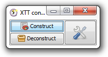
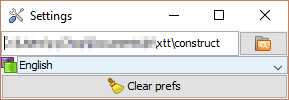

= xls-time-tracker construct
Cyrille Chopelet <cyrille.chopelet@mines-nancy.org>

// Set your repository informations here.
:github-user: KeyboardPlaying
:github-repo: xls-time-tracker-construct
:pom-groupid: org.keyboardplaying.xtt
:pom-artifactid: construct
:license-name: MIT
:license-shield: {license-name}
:license-url: http://opensource.org/licenses/MIT

// The badges. Should not require any change.
:url-shields: http://img.shields.io/
:url-sonar: sonar.keyboardplaying.org
image:{url-shields}travis/{github-user}/{github-repo}/master.svg[Build status, link="https://travis-ci.org/{github-user}/{github-repo}"]
image:{url-shields}sonar/http/{url-sonar}/{pom-groupid}:{pom-artifactid}/coverage.svg[Test coverage, link="http://{url-sonar}/drilldown/measures/?id={pom-groupid}:{pom-artifactid}&metric=coverage"]
image:{url-shields}sonar/http/{url-sonar}/{pom-groupid}:{pom-artifactid}/tech_debt.svg[Technical debt, link="http://{url-sonar}/dashboard/index?id={pom-groupid}:{pom-artifactid}"]
image:{url-shields}badge/license-{license-shield}-blue.svg[License: {license-name}, link="{license-url}"]
image:{url-shields}badge/gitter-join_chat_%E2%86%92-1dce73.svg[Join the chat, link="https://gitter.im/KeyboardPlaying/xls-time-tracker?utm_source=badge&utm_medium=badge&utm_campaign=pr-badge&utm_content=badge"]

// Now, the main documentation.
:url-main: https://github.com/KeyboardPlaying/xls-time-tracker
:url-wiki: {url-main}/wiki

This project is a utility for developers wishing to contribute to the {url-wiki}[xls-time-tracker]. It provides an easy way to switch to and fro between the version controlled source and the editable Excel file.

== Documentation

See {url-main}[xls-time-tracker]'s {url-wiki}[wiki] for documentation about this utility.

== License

The code for this project is under MIT license.

The icons from the http://tango.freedesktop.org/:[Tango Desktop Project]. Thanks to them for their hard work. and sharing.
