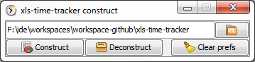

#  xls-time-tracker construct

[![MIT licensed][license-mit-badge]][license-mit]
[![Join the chat at https://gitter.im/cyChop/xls-time-tracker][gitter-badge]][gitter-channel]

This project is a utility for developers wishing to contribute to the [xls-time-tracker]. It provides an easy way to switch to and fro between the version controlled source and the editable Excel file.

## What you can do

###  Set project directory

Before building, you must configure the root of the [xls-time-tracker] project in the construct. You can either use the file selector by clicking the button or type the path in the text field.

###  Construct

Compiles the content of the `xlsx_deconstructed` directory into a `tracker.xlsx` file. The file must be closed and the directory must exist in the directory configured in the step above.

###  Deconstruct

Deconstructs the `tracker.xlsx` file and replaces the content of the `xlsx_deconstructed` directory with it. No lock must exist on any file in this directory.

###  Clear preferences

So that you don't have to set the path to the project directory each time you run the construct, it is saved in local preferences (see the [Java Preferences API](https://docs.oracle.com/javase/8/docs/technotes/guides/preferences/index.html) for more information).

If you are done with the development on this project and wish to remove all trace of it, just hit the button!

## Execution requirements

### :coffee: Java

This utility was designed to run with Java 7 or more recent.

* If you have Java on your path, double-clicking the JAR should be enough to run it.
* Otherwise, you may have to open a command-line in your Java directory and run `java -jar C:\path
\to\the\construct.jar`

## License

The code for this project is under MIT license.

The icons from the [ Tango Desktop Project](http://tango.freedesktop.org/). Thanks to them for their hard work. and sharing.

[xls-time-tracker]: https://github.com/KeyboardPlaying/xls-time-tracker
[license-mit-badge]: https://img.shields.io/badge/license-MIT-blue.svg
[license-mit]: http://opensource.org/licenses/MIT
[gitter-badge]: https://img.shields.io/badge/gitter-join_chat_%E2%86%92-1dce73.svg
[gitter-channel]: https://gitter.im/KeyboardPlaying/xls-time-tracker?utm_source=badge&utm_medium=badge&utm_campaign=pr-badge&utm_content=badge
