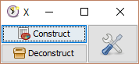

#  xls-time-tracker construct

[![MIT licensed][license-mit-badge]][license-mit]
[![Join the chat at https://gitter.im/cyChop/xls-time-tracker][gitter-badge]][gitter-channel]

This project is a utility for developers wishing to contribute to the [xls-time-tracker]. It provides an easy way to switch to and fro between the version controlled source and the editable Excel file.

## Documentation

See [xls-time-tracker]'s [wiki] for documentation about this utility.

## License

The code for this project is under MIT license.

The icons from the [Tango Desktop Project](http://tango.freedesktop.org/). Thanks to them for their hard work. and sharing.

[xls-time-tracker]: https://github.com/KeyboardPlaying/xls-time-tracker
[wiki]: https://github.com/KeyboardPlaying/xls-time-tracker/wiki
[license-mit-badge]: https://img.shields.io/badge/license-MIT-blue.svg
[license-mit]: http://opensource.org/licenses/MIT
[gitter-badge]: https://img.shields.io/badge/gitter-join_chat_%E2%86%92-1dce73.svg
[gitter-channel]: https://gitter.im/KeyboardPlaying/xls-time-tracker?utm_source=badge&utm_medium=badge&utm_campaign=pr-badge&utm_content=badge
